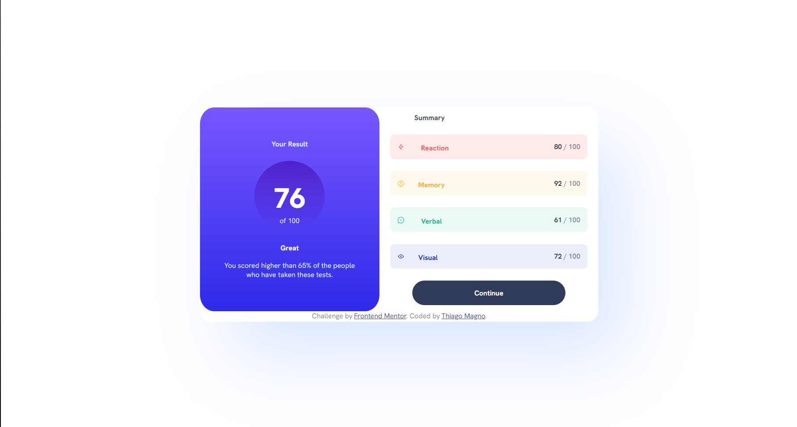
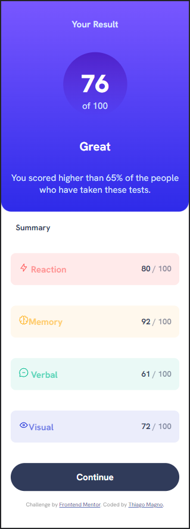

# Frontend Mentor - Results summary component solution

This is a solution to the [Results summary component challenge on Frontend Mentor](https://www.frontendmentor.io/challenges/results-summary-component-CE_K6s0maV). Frontend Mentor challenges help you improve your coding skills by building realistic projects. 

## Table of contents

- [Overview](#overview)
  - [The challenge](#the-challenge)
  - [Screenshot](#screenshot)
  - [Links](#links)
- [My process](#my-process)
  - [Built with](#built-with)
  - [What I learned](#what-i-learned)
  - [Continued development](#continued-development)
  - [Useful resources](#useful-resources)
- [Author](#author)
- [Acknowledgments](#acknowledgments)

**Note: Delete this note and update the table of contents based on what sections you keep.**

## Overview

### The challenge

Users should be able to:

- View the optimal layout for the interface depending on their device's screen size
- See hover and focus states for all interactive elements on the page
- **Bonus**: Use the local JSON data to dynamically populate the content

### Screenshot
Desktop solution


Molbile solution



### Links

- Solution URL: [Add solution URL here](https://your-solution-url.com)
- Live Site URL: [Add live site URL here](https://your-live-site-url.com)

## My process

### Built with

- Semantic HTML5 markup
- CSS custom properties
- Flexbox
- CSS Grid
- Mobile-first workflow


### What I learned

In this challenge I've revisited some of the thigs i learned in a course from Rocketseat, which I've been studying for some weeks now, I used grid, css variables, flexbox,gradient and some other concepts I had'nt practiced in a while.

I also tried usin HTML semantic for acessiblity, but I'm not used to it yet, and ended up using some parts with semantic and other with whatever was convinient.


```html
<div class="wrap">
      <main>
        <section id="result">
          <h1>Your Result</h1>
          <div id="score">
            <h2 id="score-title">76</h2>
            <p>of 100</p>
          </div>

          <h2>Great</h2>
          <p>
            You scored higher than 65% of the people who have taken these tests.
          </p>
        </section>
      </main>
```
```css
 .wrap {
    box-shadow: 4rem 5rem 10rem var(--text-color);
    border-radius: 25px;
    height: 50vh;
    width: 50vw;
    display: grid;
    grid-template-areas:
      "main aside"
      "main aside"
      "footer footer";
    grid-template-rows: 40% 55% 5%;
    grid-template-columns: 45% 55%;
  }
  
```

### Continued development

I want to practice more on mobile first and semantics for the near future, also wanto use more of grid and flexbox, to get more used to it.
The thing I foud the most useful was certainly grid, seince it alowed me to do a bunch o changes in the layout with simple commands an I want to get better at it.


### Useful resources

- [Example resource 1](https://developer.mozilla.org/en-US/docs/Web/CSS/box-shadow) - This helped me with the shadow in the layout since I had forgotten how to do them.
- [Example resource 2](https://developer.mozilla.org/pt-BR/docs/Web/CSS/CSS_media_queries/Using_media_queries) - This is an amazing article which helped me finally understand the media querys in CSS i'ts a hanfull for doing the mobile first.


## Author


- Frontend Mentor - [@ThiagoMagno](https://www.frontendmentor.io/profile/Thiago-Magno)

## Acknowledgments

So a tip i can give is check if your bowser does'nt have any zoom up or down activated, because it caused a ton of problems with my code, since evething became either too big or too small.